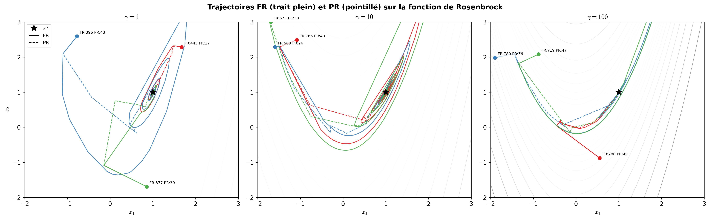

# Sloptimization

*Exploring numerical descent methods.*

An experimental study of numerical optimization through three notebooks. The project compares gradient descent, conjugate gradient, Newton's method, and BFGS to explore how step sizes, starting points, dimension, and conditioning affect their behavior.

Developed as a class project, it connects the methods studied in class with their observed trajectories, convergence, and cost in objective evaluations. The notebooks and accompanying report are in French.

## Example trajectories



An example from benchmark 2: Fletcher-Reeves trajectories appear as solid lines and Polak-Ribiere trajectories as dashed lines on the Rosenbrock function, for three values of its parameter. Each color represents a starting point, and the star marks the minimum. These starting points were chosen to illustrate pronounced differences between the methods; the annotations give their iteration counts.

## Experiments

| Notebook | Question | Test problems |
| --- | --- | --- |
| [Armijo and trajectories](benchmarks/01_armijo_and_trajectories.ipynb) | How do Armijo's two parameters affect gradient descent? | Positive-definite quadratics and Rosenbrock |
| [Fletcher-Reeves vs Polak-Ribiere](benchmarks/02_fr_vs_pr.ipynb) | How does the conjugate-gradient update affect convergence and attraction basins? | Quadratics with exact line search; multimodal, cubic, and Rosenbrock objectives with Armijo backtracking |
| [Conjugate gradient, Newton, and BFGS](benchmarks/03_cg_newton_bfgs.ipynb) | How do iteration counts and objective evaluations change with dimension and conditioning? | Positive-definite quadratics, Rosenbrock, and a multimodal objective |

The experiments use analytic gradients. Shared test functions and the quadratic generator are in [`src/test_functions.py`](src/test_functions.py). [`src/differentiation.py`](src/differentiation.py) provides a finite-difference gradient utility.

## Run the notebooks

Use Python 3.12 or newer in a virtual environment. The versions in `requirements.txt` are minimum versions.

```bash
python3 -m venv .venv
source .venv/bin/activate
python -m pip install -r requirements.txt
python -m pip install jupyterlab
cd benchmarks
python -m jupyterlab
```

Open a notebook and run its cells in order. Keep the kernel's working directory at `benchmarks/`, since imports and output paths are relative to that directory.

The full experiments can take substantial time: benchmark 1 evaluates 20,250 runs in its main sweep, and benchmark 2 evaluates 50,000 runs. Several cells use `joblib` with `n_jobs=-1` to request all available CPUs. For an initial exploration, reduce the parameter grids, seeds, or starting-point grid and choose a smaller `n_jobs`.

The notebooks save results in `results_*.npy` and `results_*.npz` files at the repository root. Figures are exported to `figures/benchmark1/`, `figures/benchmark2/`, and `figures/benchmark3/`. After changing parameters or code, move old caches aside or choose new filenames to recompute the results.

## Report

The [PDF report](report.pdf) presents the results and analysis in French. Its [LaTeX source](report.tex) and all 17 figures are included in the repository.

To rebuild the report, compile `report.tex` from the repository root with a LaTeX installation that supports French. Run the notebooks to regenerate the figures.

## Authors

[@KadirKess](https://github.com/KadirKess), [@sachaMelin](https://github.com/sachaMelin), and [@valentin-best](https://github.com/valentin-best). The report details each author's contribution.
